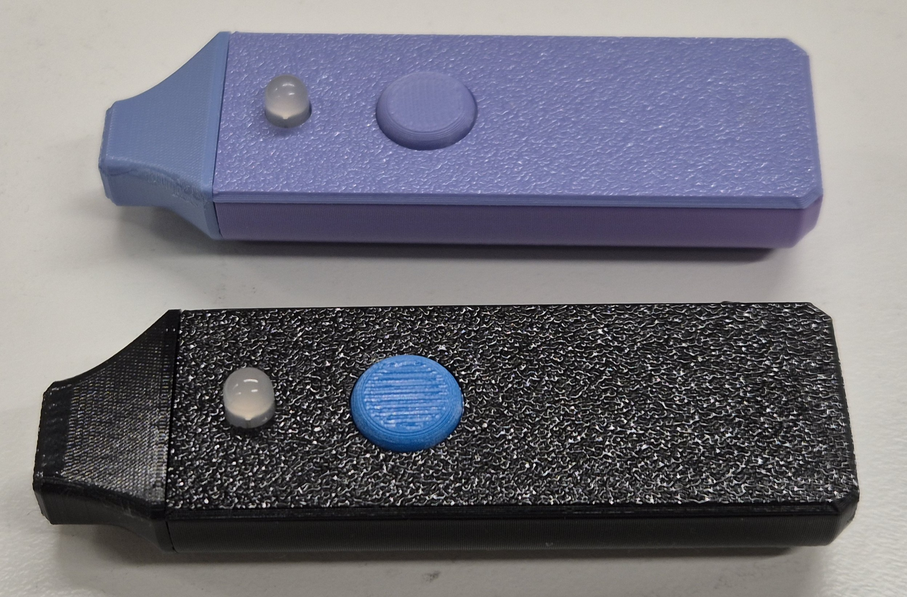
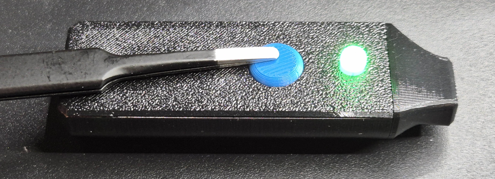
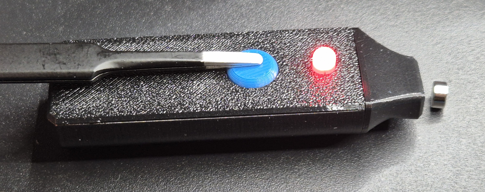
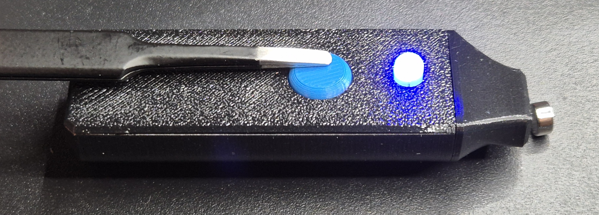
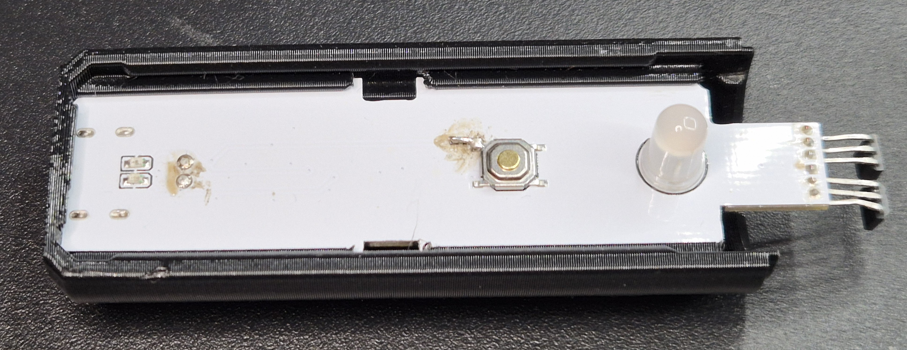
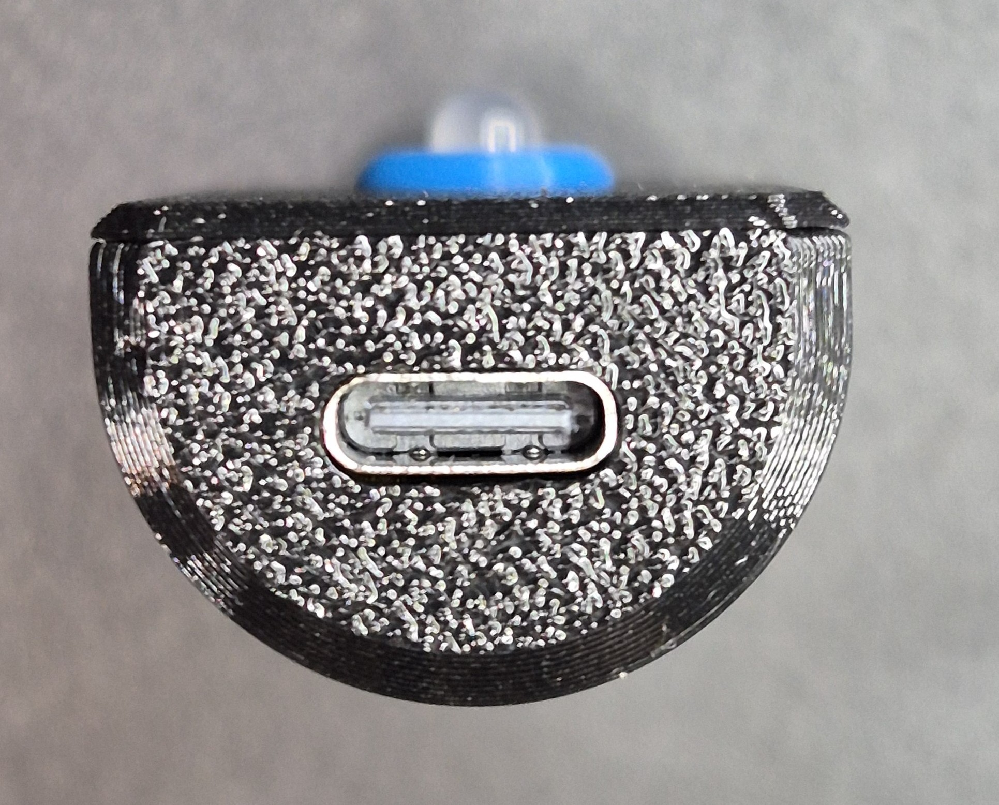

# 🧲 Magnetic Pole Detector

  

## Overview

A compact, handheld device for quickly identifying the polarity of magnets.

**Key Features:**
- 🔴 **Red LED** = North Pole detected
- 🔵 **Blue LED** = South Pole detected  
- 🟢 **Green LED** = Device powered on
- 🔋 USB-C rechargeable with integrated charging and protection circuit
- 📦 Fully 3D-printable enclosure with tool-free assembly
- ⚡ Analog-only design (no programming required)

## How It Works

Simply hold the power button to activate the device. When the tip approaches a magnet:
- The RGB LED changes color based on which magnetic pole it detects
- Completely passive and safe operation
- Instant visual feedback

  
  
  

## Specifications

| Feature | Details |
|---------|---------|
| **Battery** | 200 mAh LiPo (501240 or similar, max 5mm thick × 12mm wide) |
| **Charging** | USB-C, integrated TP4056 charging circuit |
| **Undervoltage Cutoff** | ~3V |
| **Design** | Fully analog circuit (no programming required) |
| **Enclosure** | 3D-printed plastic, tool-free click-fit assembly |

## Electronics

The device uses a purely analog circuit design, eliminating the complexity and power consumption of a microcontroller.

**Key Components:**
- **Charging & Protection:** TP4056-based LiPo charging circuit with built-in protection
- **Sensor:** Hall effect sensor for magnetic field detection
- **Output:** RGB LED for user feedback

**Battery Notes:**
- We recommend using a pre-protected LiPo cell from a reputable supplier
- Any LiPo cell ≤5mm thick and ≤12mm wide should fit
- For smaller capacity batteries, adjust charging current by modifying R4 resistor value

**Documentation & PCB:**
- Schematic available as PDF
- EasyEDA Pro project file included
- Gerber files and complete BOM ready for PCB ordering
- All files located in the `PCB/` folder

## Assembly

### 3D Printing

The enclosure is designed for tool-free assembly with precision-fit click joints.

**Print Settings:**
- **Main body:** Print standing upright (USB hole facing downward) using 0.2mm layer height
- **Tip:** Use finer 0.12mm layer height
- **Material:** Standard PLA or PETG works well
- **No supports needed** for the click-fit design

### Assembly Steps

1. Print all case parts from files in `CAD/` folder
2. Use the BendTemplate to bend the hall effect sensors into the right shape (one facing forward one backwards)
3. Assemble the PCB including the battery (double check polarity!)
4. Insert the PCB assembly into the main body
5. Insert the button cap into the hole in the cover
6. Add the cover to the main body by clicking it into place 
7. Close the front using the click-fit mechanism
8. Charge via USB-C before first use

  
  

## Project Files

- **`CAD/`** – 3D model files for case printing
- **`PCB/`** – Schematic, EasyEDA project, Gerber files, and BOM
- **`Images/`** – Reference photos

## Building This Project

This is a hobby project designed to be accessible for makers and electronics enthusiasts. All necessary files are provided to build your own detector.

## ⚠️ Disclaimer & Safety Warning

**This is a hobby project, not a commercial product.** Use at your own risk.

### Lithium Battery Safety

Working with lithium-ion/lithium-polymer batteries carries inherent risks including but not limited to:
- **Fire and explosion hazards** if damaged, short-circuited, or improperly charged
- **Toxic chemical exposure** from cell rupture or leakage
- **Thermal runaway** leading to rapid heat generation and potential injury

**Only attempt this project if you:**
- Have prior experience with lithium battery handling and safety protocols
- Understand the risks and accept full responsibility for those risks
- Have access to proper charging and testing equipment
- Can work in a safe environment with appropriate fire suppression nearby
- Comply with all local regulations regarding lithium battery transportation and storage

**I strongly recommend:** Using a pre-protected LiPo cell (with built-in protection circuit) from a reputable supplier. Do not attempt to use bare cells without proper protection circuitry.

### Liability Disclaimer

I provide this project "as-is" without warranties of any kind, express or implied. **I am not responsible for:**
- Injuries or burns resulting from battery failure or mishandling
- Property damage caused by fire, explosion, or chemical leakage
- Damage to equipment or devices
- Any direct, indirect, incidental, or consequential damages arising from your use of this project
- Regulatory violations or fines related to battery handling in your jurisdiction

**By building this project, you assume all liability and risk.**

If you are inexperienced with lithium batteries or electronics, **consult with a qualified professional before proceeding.**
